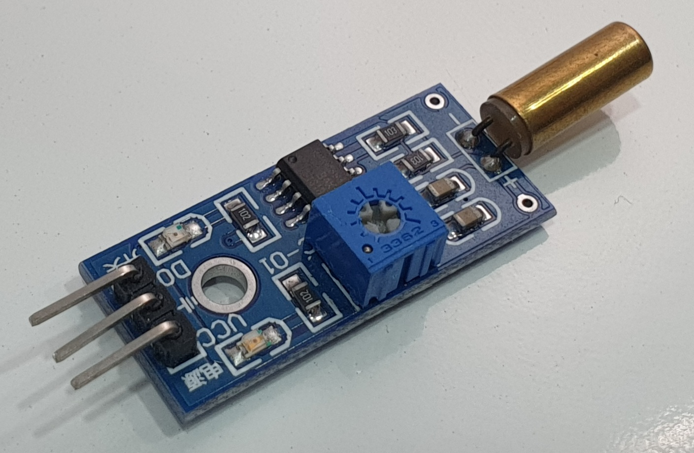
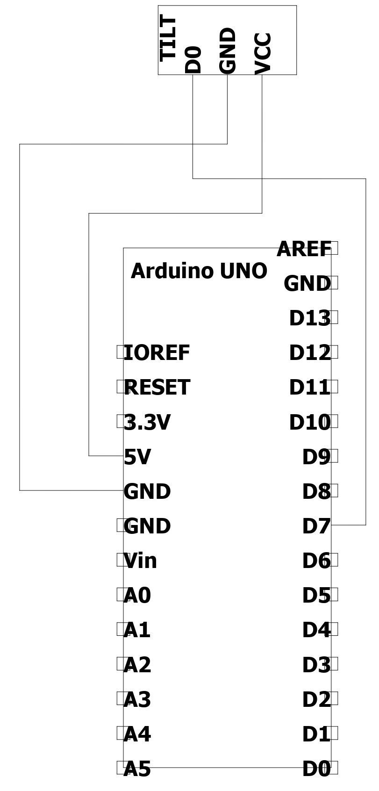

# tilt sensor(기울기 센서) SW-520D
	- 기울기가 가해졌을 때 HIGH값 출력을 하는 센서입니다.
	- 제품의 가변저항을 조절하여 값을 출력하는 민감도를 조절할 수 있습니다.

## 제품 사진

## 사양
	- 작동 전압 : 3.3V ~ 5V

## 필요 H/W
	- tilt sensor
	- Arduino UNO
	- UNO cable
	- M-F cable(3ea)

## 연결
	- D7 대신 다린 디지털 핀에 연결하여 사용가능(본문에서는 D7사용)

|SW-520D|Arduino UNO|
|--|--|
|D0|D7(변경가능)|
|GND|GND|
|VCC|5V|

## example_code_1 참고
	- 실행 결과
